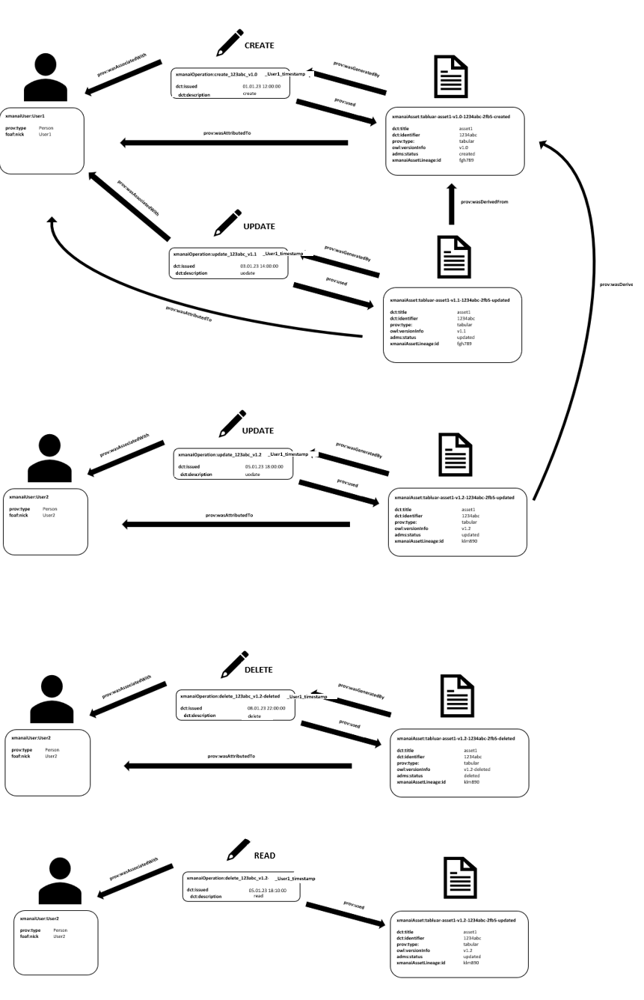
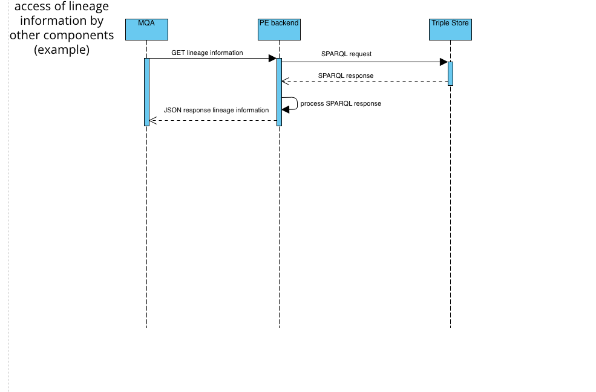
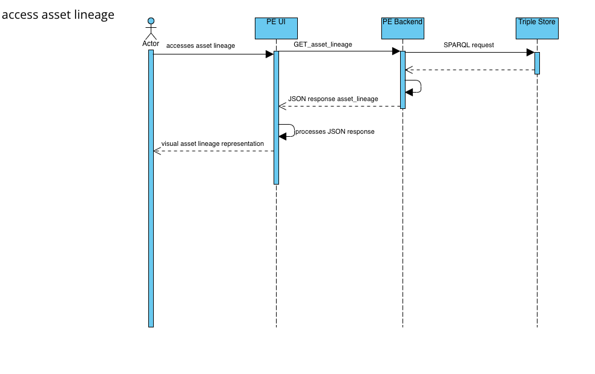
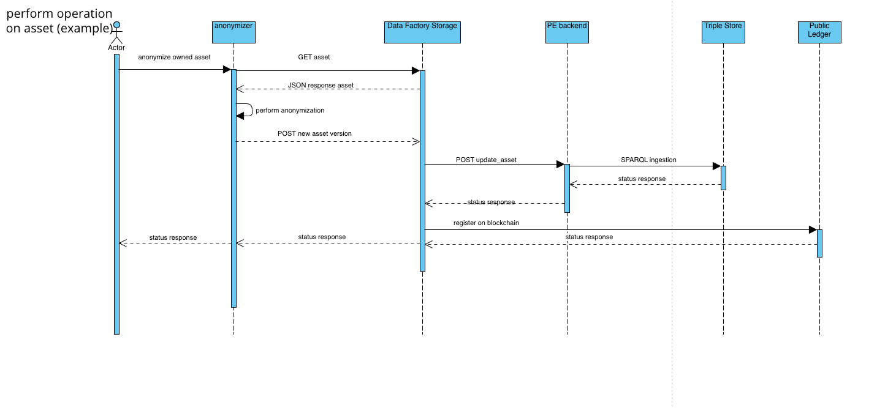
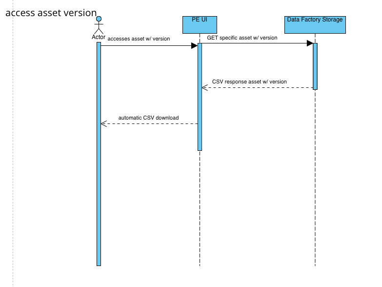
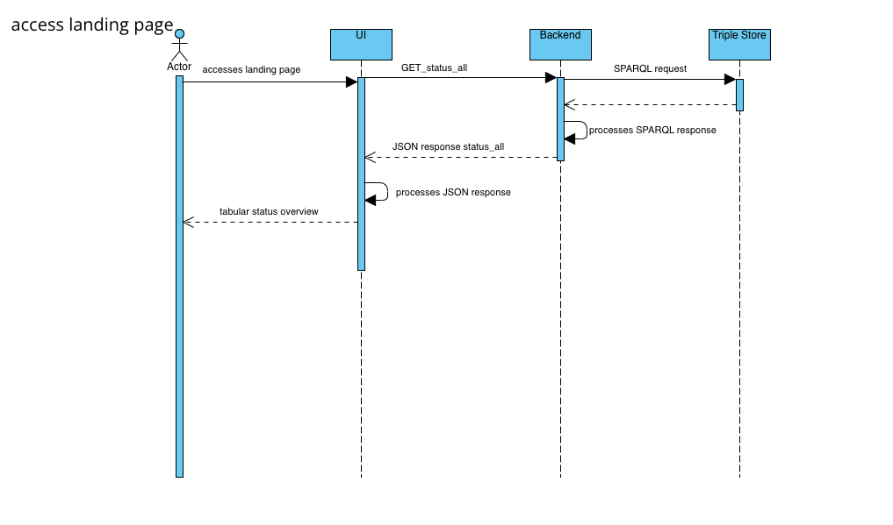
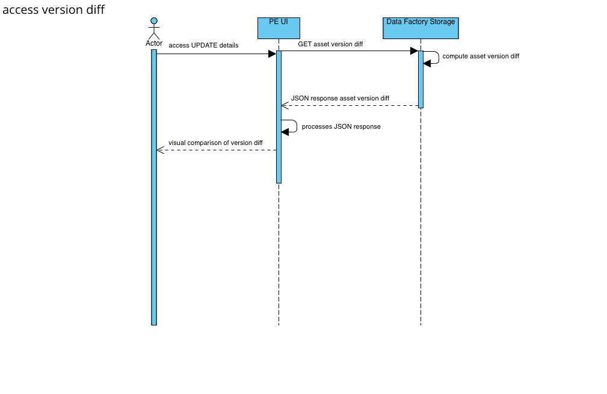

**Remark:** This repo contains the code of the Lineage Tracker Backend, the documentation section however refers to to it as a whole (including the UI).

# Setup

Tracking CRUD operation and storing them as linked data in the context of PISTIS.

## Getting started in Docker

docker build -t lineage-tracker .

docker-compose up

# Documentation 

## Summary

The Lineage Tracker is based on the Provenance Engine, which was originally developed for XMANAI EU project. It tracks CRUD operations performed on (meta-)datasets and thereby constructs data-lineages, representing the life line of individual datasets and giving insights into WHO performed WHAT action on WHICH VERSION of WHICH DATASET and WHEN. The emerging lineage tree is constructed in RDF format according to the [W3C Prov Ontology](https://www.w3.org/TR/prov-o/) and stored in a Virtuoso Triple Store. The stored Lineage Information is processed and is provided in a structured format via the respective endpoints. A UI, which is supposed to visualize this lineage information is in development.

## Working Deployment

[Frontend](https://develop.pistis-market.eu/srv/lt-ui)
[Backend](https://develop.pistis-market.eu/srv/lineage-tracker)

## Concept

The relationships between the different entities within the Prov-Ontology is depicted below.

An ENTITY is generated by an OPERATION, which is attributed to a specific AGENT.

- A dataset with a UUID can only be created if it does not exist already.
Update operations lead to the creation of an entity, which is related to its previous version. In the PROV-Ontology, this new version, is an alone-standing ENTITY, which is related to its previous version by the "prov:wasDerived" predicate.
The deletion of a dataset leads to the creation of a new dataset version (=ENTITY), with a "-deleted" tag in its version tag. This dataset cannot be updated or read anymore.

- Creating a new version based on a much older version (e.g. v1.1 → v.1.3, while v1.2 exists already) is possible and leads to a new dataset ENTITY being created, which now posseses a different lineageID. One lineageID always represents one lineage branch.

- ENTITY, OPERATION and AGENT are RDF-entities defined (and thus either subject or object within triplets) by the PROV-Ontology and, as can be seen above, can be enriched with additional attributes from different vocabularies to store more information.

## Implementation

- The Lineage Tracker is implemented utilizing the (python-prov-framework)[https://github.com/trungdong/prov], which provides an abstraction layer for constructing the RDF graph.

- The API provides two types of endpoints, one for ingesting (documenting) actions performed on datasets and another one for retrieving the documented lineage information associated with a specific datasets. The retrieval-endpoint provide this information in structured JSON format.

- The UI will be developed using Vue-JS. It will not only utilize the Lineage Tracker API to retrieve information but also the component, in which the actual different versions of the datasets are being stored, to give the user access to the actual data and visualize the delta between different versions. In the context of PISTIS, this component will be the (Data Factory Storage)[https://confluencesrv.fokus.fraunhofer.de/display/PIS/Factory+Data+Storage]

## PISTIS Use Case

Remark: In RDF, subjects and objects require URIs to describe them. Optimally they would point on a web-page, giving a description of the respective entity. In the PISTIS use case, these URIs are just simple unique strings, which are generated dynamically and among other things, include the UUID of the respective dataset. 

The different use cases within the PISTIS platform are depicted in the sequence diagrams below:

