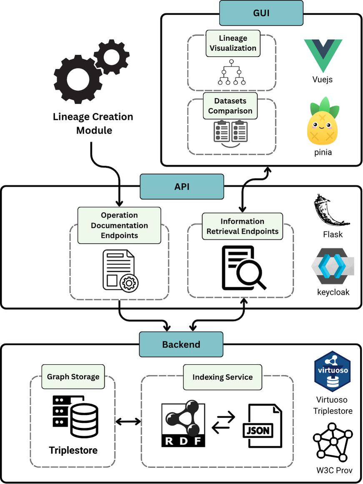

# Lineage Tracker

## Overview

The **Lineage Tracker** is an open‑source data provenance and lineage system built for the PISTIS platform that provides comprehensive tracking and visualization of a dataset's evolution. The system records every create, update, and delete operation performed on a dataset, documenting the actor, timestamp, and nature of each change. Each operation is then translated into RDF according to the W3C PROV-Ontology and persisted in a triple store, incrementally constructing a comprehensive lineage graph of the dataset's evolution.

Upon each update, the system computes the diff between successive versions and stores a textual summary of the modifications made. Additionally, a cryptographic hash of this updated lineage snapshot is computed and anchored on a blockchain to ensure an immutable, verifiable audit trail. This comprehensive lineage history grants users full visibility into a dataset's evolution as well as access to any prior version.

The Lineage Tracker offers API endpoints for logging create, update, and delete operations on a dataset; retrieving structured lineage data; and transferring a dataset's lineage between different catalogs. Each incoming operation is serialized into RDF and persisted in a triple store, thereby incrementally extending the dataset's lineage graph. Clients may then query the API to obtain a dataset's full history, its lineage graph, the complete history of a particular user, or the diff between two dataset versions.

The system provides a user-friendly user interface (UI) with two primary pages. The Lineage History page displays an interactive lineage tree of all dataset versions alongside a detailed history table, listing each operation's timestamp, actor, and operation description. The Dataset Versions page enables users to select any two dataset versions and review their differences in a comparison table, detailing all additions, deletions, and modifications.

## Features

- **W3C PROV-DM Compliance**: Standardized provenance and lineage data modeling using W3C PROV Data Model and PROV Ontology for maximum interoperability.
- **Comprehensive Operation Recording**: Automatic capture of Create, Update, and Delete operations with detailed actor attribution, timestamps, and operation descriptions.
- **Semantic Graph Storage**: RDF triples stored in Virtuoso triple store with SPARQL querying capabilities, enabling complex relationship modeling.
- **Intelligent Diff Analysis**: Automatic detection and summarization of changes between dataset versions, including schema and data modifications, data transformations, and enrichments.
- **Graphical User Interface**: 
  - **Lineage Visualization Page**: Interactive family tree with detailed history tables showing chronological operations
  - **Dataset Comparison Page**: Side-by-side version comparison with granular change highlighting
- **RESTful API Architecture**:
  - **Operation Documentation Module**: Records dataset lifecycle events in real-time
  - **Information Retrieval Module**: Provides structured lineage data and version comparison capabilities

## Architecture

The overall lineage tracker architecture can be seen in the figure below.



## Getting Started

### Try the Live Demo

- **Frontend**: https://develop.pistis-market.eu/srv/lt-ui/ee06133a-eb9c-4c16-8af7-993090e0e061
- **Backend**: https://develop.pistis-market.eu/srv/lineage-tracker

### Local Setup

Ensure you have the following installed:
- Docker & Docker Compose
- Node.js ≥23 with npm
- Python ≥3.12 with pip

Clone the repository:

```bash
git clone https://github.com/your-org/lineage-tracker.git
cd lineage-tracker
```

Copy and customize the example environment files under `/frontend` and `/backend` as described above.

## Backend

### Prerequisites

- Python ≥3.12
- pip
- Docker (for Virtuoso Triple Store)

### Configuration

Copy the example environment file and customize it for your setup:

```bash
cd backend
cp .env.example .env
```

Edit the `.env` file to configure the following variables:

**What each variable does:**
- **BASE_HOST**: The root URL where this API serves requests.
- **VIRTUOSO_HOST**: Endpoint used for all SPARQL queries against the RDF store.
- **LOG_LEVEL**: Controls how verbose the application logs are for debugging or production.
- **SWAGGER_SWAGGER_URL**: Where the interactive API docs (Swagger UI) are exposed.
- **SWAGGER_API_URL**: Location of the raw OpenAPI JSON used by the docs.
- **KEYCLOAK_TOKEN_URL**: OAuth2 token URL for obtaining access tokens from Keycloak.
- **KEYCLOAK_CLIENT_ID / KEYCLOAK_CLIENT_SECRET**: Credentials for the API's service account in Keycloak.
- **DBA_PASSWORD**: Virtuoso DBA account password, granting read/write access to the triple store.

### Setup & Running

1. **Start Lineage Tracker Backend and Virtuoso Triplestore**
   ```bash
   docker build -t lineage-tracker .
   docker-compose up
   ```
2. **Access the API**
   Navigate to `http://localhost:8080`

## Frontend

### Prerequisites

- Node.js ≥23
- npm or Yarn

### Configuration

Copy the example environment file and customize it for your setup:

```bash
cd frontend
cp .env.example .env
```

Edit the `.env` file to configure the following variables:

**What each variable does:**
- **VITE_FACTORY_OR_CLOUD**: Specifies whether the frontend is running in factory or cloud mode.
- **VITE_FRONTEND_BASE_API_HOST**: Local API endpoint for frontend development and testing.
- **VITE_BACKEND_BASE_API_HOST**: Remote API endpoint for production backend services.
- **VITE_KEYCLOAK_URL**: Keycloak authentication server URL for user login and verification.
- **VITE_KEYCLOAK_CLIENT_ID**: Client ID registered in Keycloak for this frontend application.
- **VITE_KEYCLOAK_REALM**: Keycloak realm name that contains the authentication configuration.
- **VITE_EXTERNAL_LOGIN_URL**: External URL for user login redirection and logout operations.

### Setup & Running

```bash
cd frontend
npm install
npm run dev  # http://localhost:5173
```

## API Reference

### Servers

- **Local**: `http://localhost:8080/`
- **Factory**: `https://develop.pistis-market.eu/srv/lineage-tracker/`
- **Cloud**: `https://pistis-market.eu/srv/lineage-tracker/`

### Authentication

All endpoints require an API key in the `Authorization` header (`apiKey`).

### Operation Documentation

These endpoints record CRUD operations in the Lineage Information Store:

| Method | Path                  | Summary                                                                      |
| ------ | --------------------- | ---------------------------------------------------------------------------- |
| POST   | `/create_dataset`     | Document creation of a new dataset.                                          |
| POST   | `/update_dataset`     | Document an update by comparing two dataset versions (`uuid_prev` → `uuid`). |
| POST   | `/delete_dataset`     | Document deletion of an existing dataset.                                    |
| POST   | `/delete_family_tree` | Document deletion of an entire dataset family tree.                          |

### Information Retrieval

Retrieve lineage and operation data:

| Method | Path                          | Parameters                              | Summary                                                           |
| ------ | ----------------------------- | --------------------------------------- | ----------------------------------------------------------------- |
| GET    | `/get_dataset_family_tree`    | `uuid`                                  | Full family tree with latest operation per branch.                |
| GET    | `/get_dataset_lineage`        | `uuid`                                  | Complete lineage detailing each version's operation.              |
| GET    | `/get_dataset_history`        | `uuid`, optional `user_group`           | Chronological list of all operations for a dataset.               |
| GET    | `/get_dataset_status`         | `uuid`                                  | The most recent operation on a dataset.                           |
| GET    | `/get_dataset_num_operations` | `uuid`                                  | Counts of create, update, and delete operations.                  |
| GET    | `/get_datasets_diff`          | `uuid_1`, `uuid_2`, optional `is_cloud` | Differences between two dataset versions (added/removed/changed). |
| GET    | `/get_user_history`           | `username`                              | All operations performed by a given user.                         |

### Lineage Transfer

Manage import/export of lineage between factory and cloud:

| Method | Path             | Summary                                                                                             |
| ------ | ---------------- | --------------------------------------------------------------------------------------------------- |
| GET    | `/read_lineage`  | Export lineage from the root dataset to `dataset_id`, excluding child branches.                     |
| POST   | `/write_lineage` | Import a lineage payload (`dataset_lineage`) in direction `factory-to-cloud` or `cloud-to-factory`. |

## Working Deployments

- **Frontend**: https://develop.pistis-market.eu/srv/lt-ui/ee06133a-eb9c-4c16-8af7-993090e0e061
- **Backend**: https://develop.pistis-market.eu/srv/lineage-tracker

## License

[Apache 2.0](http://www.apache.org/licenses/LICENSE-2.0)

